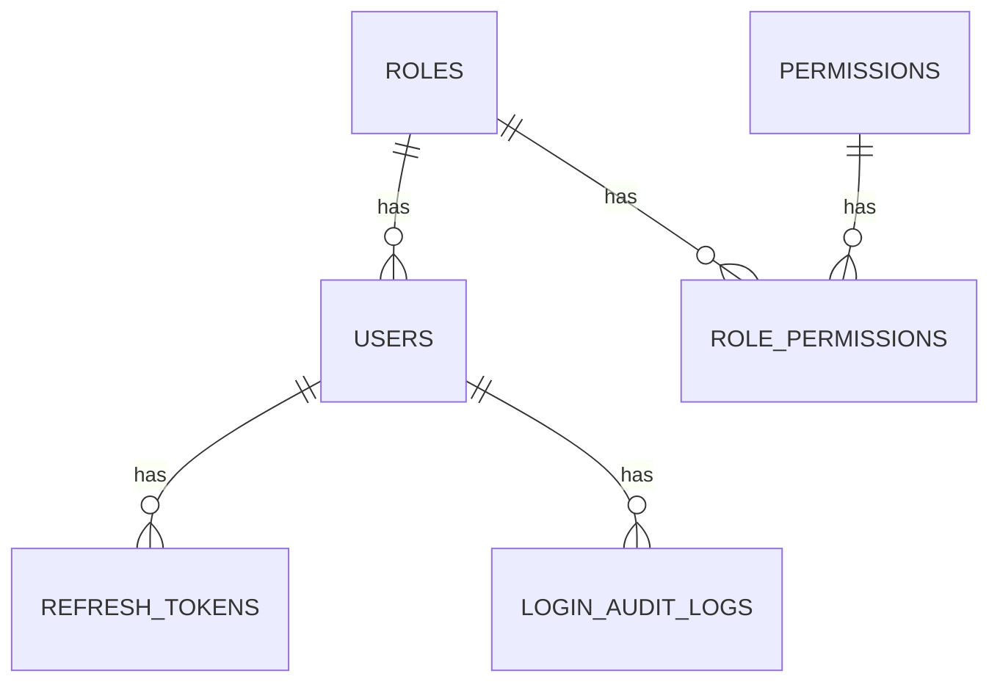
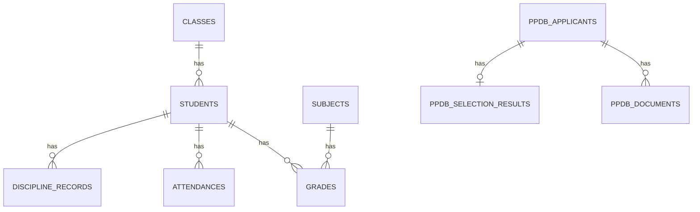
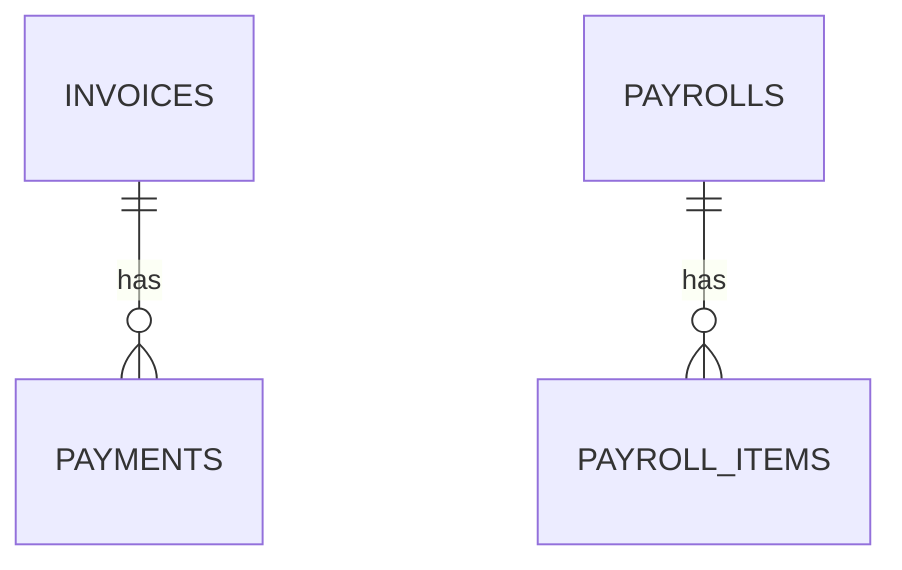
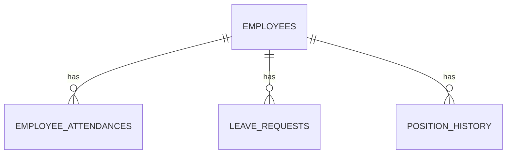

# SKEMA-DATABASE.md — Skema Database Seluruh Service SIMS

> Satu database per service, TIDAK ADA foreign key fisik lintas database (lihat `rules.md` §3).
> Referensi lintas service disimpan sebagai kolom `id_referensi_*` (UUID polos, tanpa FK constraint) dan divalidasi lewat API/event, bukan lewat JOIN database.
> Konvensi: nama tabel tetap Bahasa Inggris (konsisten dengan `modul-pengerjaan.md`), **nama kolom memakai Bahasa Indonesia** agar mudah dipahami. Semua tabel punya `dibuat_pada`/`diperbarui_pada`, data siswa & pegawai pakai soft delete (`dihapus_pada`), tabel akademik & keuangan pakai audit trail (`dibuat_oleh`, `diperbarui_oleh`) sesuai NFR-05 PRD.

---

## 1. `db_auth` — Auth Service

### `users`
| Kolom | Tipe | Constraint | Keterangan |
|---|---|---|---|
| id | uuid | PK | |
| nama_pengguna | varchar(50) | unique, not null | |
| email | varchar(150) | unique, not null | |
| hash_kata_sandi | varchar(255) | not null | bcrypt/argon2 |
| id_peran | uuid | FK → roles.id | |
| jenis_referensi | varchar(20) | nullable | enum: `student`, `employee`, `parent`, `none` |
| id_referensi | uuid | nullable | ref logis ke `students.id` (db_akademik) atau `employees.id` (db_hris) |
| aktif | boolean | default true | |
| dibuat_pada / diperbarui_pada / dihapus_pada | timestamp | | soft delete |

### `roles`
| Kolom | Tipe | Constraint | Keterangan |
|---|---|---|---|
| id | uuid | PK | |
| nama | varchar(30) | unique | admin, guru, keuangan, hris, ortu, siswa |
| deskripsi | text | nullable | |
| dibuat_pada / diperbarui_pada | timestamp | | |

### `permissions`
| Kolom | Tipe | Constraint | Keterangan |
|---|---|---|---|
| id | uuid | PK | |
| kode | varchar(100) | unique | contoh: `student.create`, `invoice.read` |
| deskripsi | text | nullable | |

### `role_permissions` (pivot)
| Kolom | Tipe | Constraint |
|---|---|---|
| id_peran | uuid | FK → roles.id, PK gabungan |
| id_izin | uuid | FK → permissions.id, PK gabungan |

### `refresh_tokens`
| Kolom | Tipe | Constraint | Keterangan |
|---|---|---|---|
| id | uuid | PK | |
| id_pengguna | uuid | FK → users.id | |
| hash_token | varchar(255) | not null | jangan simpan token mentah |
| berakhir_pada | timestamp | not null | |
| dicabut_pada | timestamp | nullable | |
| dibuat_pada | timestamp | | |

### `login_audit_logs` *(FR-AUTH-05)*
| Kolom | Tipe | Constraint | Keterangan |
|---|---|---|---|
| id | uuid | PK | |
| id_pengguna | uuid | FK → users.id, nullable | nullable kalau username tidak ditemukan |
| nama_pengguna_dicoba | varchar(150) | | |
| alamat_ip | varchar(45) | | |
| agen_pengguna | text | nullable | user agent browser/device |
| status | varchar(20) | | `success` / `failed` |
| dibuat_pada | timestamp | | |

---

## 2. `db_akademik` — Akademik Service

### `students` *(FR-AKD-01)*
| Kolom | Tipe | Constraint | Keterangan |
|---|---|---|---|
| id | uuid | PK | |
| nisn | varchar(20) | unique, nullable | bisa kosong sebelum terbit dari Dapodik |
| nik | varchar(20) | unique | |
| nama_lengkap | varchar(150) | not null | |
| tempat_lahir | varchar(100) | | |
| tanggal_lahir | date | | |
| jenis_kelamin | varchar(10) | | |
| alamat | text | | |
| id_referensi_pengguna_ortu | uuid | nullable | ref logis ke `users.id` (db_auth) akun ortu |
| id_kelas | uuid | FK → classes.id | |
| status | varchar(20) | | `aktif`/`lulus`/`pindah`/`keluar` |
| tanggal_masuk | date | | |
| dibuat_pada / diperbarui_pada / dihapus_pada | timestamp | | soft delete |
| dibuat_oleh / diperbarui_oleh | uuid | | audit trail |

### `classes`
| Kolom | Tipe | Constraint | Keterangan |
|---|---|---|---|
| id | uuid | PK | |
| nama | varchar(20) | | contoh: `7A` |
| tingkat_kelas | varchar(10) | | |
| tahun_ajaran | varchar(10) | | contoh: `2026/2027` |
| id_referensi_guru_wali | uuid | nullable | ref logis ke `employees.id` (db_hris) |
| dibuat_pada / diperbarui_pada | timestamp | | |

### `subjects`
| Kolom | Tipe | Constraint |
|---|---|---|
| id | uuid | PK |
| nama | varchar(100) | not null |
| kode | varchar(20) | unique |

### `grades` *(FR-AKD-02)*
| Kolom | Tipe | Constraint | Keterangan |
|---|---|---|---|
| id | uuid | PK | |
| id_siswa | uuid | FK → students.id | |
| id_mata_pelajaran | uuid | FK → subjects.id | |
| semester | varchar(10) | | `Ganjil`/`Genap` |
| tahun_ajaran | varchar(10) | | |
| nilai | numeric(5,2) | | |
| jenis_nilai | varchar(20) | | `UH`/`UTS`/`UAS`/`tugas` |
| id_referensi_penginput | uuid | | ref logis ke guru (`employees.id`) |
| dibuat_pada / diperbarui_pada | timestamp | | |
| dibuat_oleh / diperbarui_oleh | uuid | | audit trail |

### `attendances` *(FR-AKD-03)*
| Kolom | Tipe | Constraint | Keterangan |
|---|---|---|---|
| id | uuid | PK | |
| id_siswa | uuid | FK → students.id | |
| id_kelas | uuid | FK → classes.id | |
| tanggal | date | | |
| status | varchar(20) | | `hadir`/`sakit`/`izin`/`alpa` |
| id_referensi_pencatat | uuid | | |
| dibuat_pada / diperbarui_pada | timestamp | | |

### `discipline_records` *(FR-AKD-04)*
| Kolom | Tipe | Constraint | Keterangan |
|---|---|---|---|
| id | uuid | PK | |
| id_siswa | uuid | FK → students.id | |
| deskripsi_pelanggaran | text | | |
| poin | int | | |
| tindak_lanjut | text | nullable | |
| id_referensi_pencatat | uuid | | |
| dicatat_pada | timestamp | | |
| dibuat_pada / diperbarui_pada | timestamp | | |

### `ppdb_applicants` *(FR-AKD-05)*
| Kolom | Tipe | Constraint | Keterangan |
|---|---|---|---|
| id | uuid | PK | |
| nama_lengkap | varchar(150) | | |
| nik | varchar(20) | | |
| tanggal_lahir | date | | |
| nama_orang_tua | varchar(150) | | |
| kontak_orang_tua | varchar(50) | | |
| nomor_pendaftaran | varchar(30) | unique | |
| status | varchar(20) | | `submitted`/`verified`/`selected`/`rejected`/`accepted` |
| dibuat_pada / diperbarui_pada | timestamp | | |

### `ppdb_documents`
| Kolom | Tipe | Constraint | Keterangan |
|---|---|---|---|
| id | uuid | PK | |
| id_pendaftar | uuid | FK → ppdb_applicants.id | |
| jenis_dokumen | varchar(50) | | akta/kk/ijazah/dll |
| lokasi_berkas | varchar(255) | | |
| terverifikasi | boolean | default false | |
| id_referensi_verifikator | uuid | nullable | |
| dibuat_pada / diperbarui_pada | timestamp | | |

### `ppdb_selection_results`
| Kolom | Tipe | Constraint | Keterangan |
|---|---|---|---|
| id | uuid | PK | |
| id_pendaftar | uuid | FK → ppdb_applicants.id | |
| nilai | numeric(5,2) | nullable | |
| hasil | varchar(20) | | `diterima`/`tidak diterima` |
| diumumkan_pada | timestamp | | |
| dibuat_pada / diperbarui_pada | timestamp | | |

---

## 3. `db_keuangan` — Keuangan Service

### `invoices` *(FR-KEU-01)*
| Kolom | Tipe | Constraint | Keterangan |
|---|---|---|---|
| id | uuid | PK | |
| id_referensi_siswa | uuid | | ref logis ke `students.id` (db_akademik) |
| periode | varchar(7) | | format `YYYY-MM` |
| jumlah | numeric(12,2) | | |
| tanggal_jatuh_tempo | date | | |
| status | varchar(20) | | `unpaid`/`partial`/`paid`/`overdue` |
| dibuat_pada / diperbarui_pada | timestamp | | |
| dibuat_oleh / diperbarui_oleh | uuid | | audit trail |

### `payments` *(FR-KEU-02)*
| Kolom | Tipe | Constraint | Keterangan |
|---|---|---|---|
| id | uuid | PK | |
| id_tagihan | uuid | FK → invoices.id | |
| jumlah | numeric(12,2) | | |
| metode | varchar(20) | | `manual`/`transfer`/`gateway` |
| referensi_gateway | varchar(100) | nullable | diisi setelah payment gateway dipilih (lihat PRD §10) |
| dibayar_pada | timestamp | | |
| id_referensi_pencatat | uuid | nullable | |
| dibuat_pada / diperbarui_pada | timestamp | | |

### `bos_funds` *(FR-KEU-04)*
| Kolom | Tipe | Constraint | Keterangan |
|---|---|---|---|
| id | uuid | PK | |
| periode | varchar(7) | | |
| jumlah_diterima | numeric(14,2) | | |
| jumlah_dialokasikan | numeric(14,2) | | |
| catatan_alokasi | text | nullable | |
| dibuat_pada / diperbarui_pada | timestamp | | |

### `payrolls` *(FR-KEU-05)*
| Kolom | Tipe | Constraint | Keterangan |
|---|---|---|---|
| id | uuid | PK | |
| id_referensi_pegawai | uuid | | ref logis ke `employees.id` (db_hris) |
| periode | varchar(7) | | |
| gaji_pokok | numeric(12,2) | | |
| total_tunjangan | numeric(12,2) | | |
| total_potongan | numeric(12,2) | | |
| gaji_bersih | numeric(12,2) | | |
| status | varchar(20) | | `draft`/`paid` |
| dibayar_pada | timestamp | nullable | |
| dibuat_pada / diperbarui_pada | timestamp | | |

### `payroll_items`
| Kolom | Tipe | Constraint | Keterangan |
|---|---|---|---|
| id | uuid | PK | |
| id_penggajian | uuid | FK → payrolls.id | |
| jenis_komponen | varchar(20) | | `allowance`/`deduction` |
| nama_komponen | varchar(100) | | contoh: `Tunjangan Transport`, `BPJS` |
| jumlah | numeric(12,2) | | |

---

## 4. `db_hris` — HRIS Service

### `employees` *(FR-HRIS-01)*
| Kolom | Tipe | Constraint | Keterangan |
|---|---|---|---|
| id | uuid | PK | |
| nip | varchar(30) | unique, nullable | |
| nama_lengkap | varchar(150) | | |
| jabatan | varchar(100) | | |
| jenis_kepegawaian | varchar(20) | | `tetap`/`honorer` |
| id_referensi_pengguna | uuid | nullable | ref logis ke `users.id` (db_auth) |
| tanggal_masuk | date | | |
| status | varchar(20) | | `aktif`/`nonaktif` |
| dibuat_pada / diperbarui_pada / dihapus_pada | timestamp | | soft delete |
| dibuat_oleh / diperbarui_oleh | uuid | | audit trail |

### `employee_attendances` *(FR-HRIS-02)*
| Kolom | Tipe | Constraint | Keterangan |
|---|---|---|---|
| id | uuid | PK | |
| id_pegawai | uuid | FK → employees.id | |
| tanggal | date | | |
| jam_masuk | time | nullable | |
| jam_keluar | time | nullable | |
| status | varchar(20) | | `hadir`/`izin`/`sakit`/`alpa` |
| dibuat_pada / diperbarui_pada | timestamp | | |

### `leave_requests` *(FR-HRIS-03)*
| Kolom | Tipe | Constraint | Keterangan |
|---|---|---|---|
| id | uuid | PK | |
| id_pegawai | uuid | FK → employees.id | |
| jenis | varchar(20) | | `cuti`/`izin`/`sakit` |
| tanggal_mulai | date | | |
| tanggal_selesai | date | | |
| alasan | text | nullable | |
| status | varchar(20) | | `pending`/`approved`/`rejected` |
| id_referensi_penyetuju | uuid | nullable | |
| dibuat_pada / diperbarui_pada | timestamp | | |

### `position_history` *(FR-HRIS-04)*
| Kolom | Tipe | Constraint | Keterangan |
|---|---|---|---|
| id | uuid | PK | |
| id_pegawai | uuid | FK → employees.id | |
| jabatan | varchar(100) | | |
| tanggal_mulai | date | | |
| tanggal_selesai | date | nullable | |
| catatan_kinerja | text | nullable | |
| dibuat_pada / diperbarui_pada | timestamp | | |

---

## 5. Peta Referensi Lintas Service

| Kolom | Berada di | Menunjuk ke (logis) |
|---|---|---|
| `users.id_referensi` | db_auth | `students.id` (db_akademik) atau `employees.id` (db_hris) |
| `students.id_referensi_pengguna_ortu` | db_akademik | `users.id` (db_auth) |
| `classes.id_referensi_guru_wali` | db_akademik | `employees.id` (db_hris) |
| `invoices.id_referensi_siswa` | db_keuangan | `students.id` (db_akademik) |
| `payrolls.id_referensi_pegawai` | db_keuangan | `employees.id` (db_hris) |
| `employees.id_referensi_pengguna` | db_hris | `users.id` (db_auth) |

> Semua baris di atas **tidak boleh** dibuat sebagai FK database fisik (beda database/service). Validasi keberadaan data dilakukan lewat pemanggilan API service pemilik data, bukan JOIN.

## 6. Field yang Disinkronkan via Event Kafka

| Event | Publisher | Consumer | Field yang berubah |
|---|---|---|---|
| `student.account.requested` | Akademik Service | Auth Service | trigger pembuatan `users` baru dari `ppdb_applicants` yang diterima |
| `spp.lunas` | Keuangan Service | Akademik Service | update `students.status` terkait (bukan kolom baru, gunakan status/flag yang sudah ada) |

> Detail payload tiap event dicatat terpisah di `events.md` (lihat `rules.md` §3 — kontrak event wajib didokumentasikan sebelum diimplementasikan).

## 7. Catatan Migration

- Setiap tabel di atas = satu file migration terpisah, dijalankan lewat tool migration (`golang-migrate`), sesuai `rules.md` §5.
- Urutan migration mengikuti urutan modul di `modul-pengerjaan.md` (Auth → Akademik → Keuangan → HRIS).
- Index minimal wajib: semua kolom `id_*` / `id_referensi_*` yang dipakai untuk filter/join, kolom `status`, kolom `email`/`nama_pengguna`/`nisn`/`nik` yang unique.
